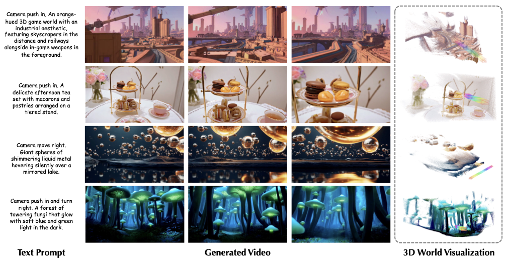
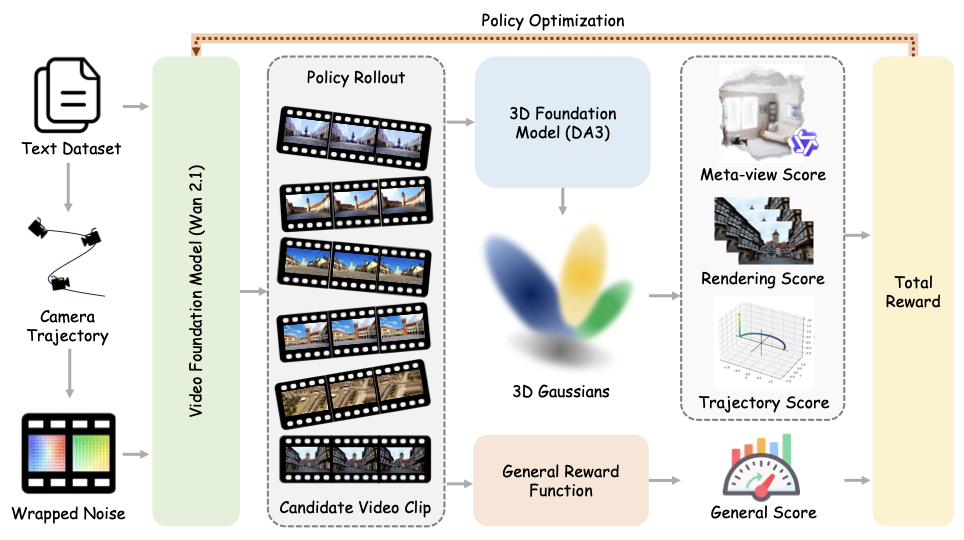

<h1 align="center">World-R1: Reinforcing 3D Constraints for Text-to-Video Generation</h1>

<p align="center">
  <a href="main.pdf"></a>
  <a href="https://aka.ms/world-r1"></a>
</p>

<p align="center">
  <a href="https://lhmd.top/">Weijie Wang</a><sup>1,2,*,&#8224;</sup> &nbsp;
  <a href="https://github.com/Shredded-Pork">Xiaoxuan He</a><sup>1,*</sup> &nbsp;
  <a href="https://github.com/Tacossp">Youping Gu</a><sup>1,*</sup> &nbsp;
  <a href="https://www.microsoft.com/en-us/research/people/yifanyang/">Yifan Yang</a><sup>2,&#8225;</sup>
  <br>
  <a href="https://steve-zeyu-zhang.github.io/">Zeyu Zhang</a><sup>3</sup> &nbsp;
  <a href="https://openreview.net/profile?id=~Yefei_He1">Yefei He</a><sup>1</sup> &nbsp;
  <a href="https://github.com/DINGYANB">Yanbo Ding</a><sup>2</sup> &nbsp;
  <a href="https://openreview.net/profile?id=~Xirui_Hu1">Xirui Hu</a><sup>3</sup>
  <br>
  <a href="https://donydchen.github.io/">Donny Y. Chen</a><sup>3</sup> &nbsp;
  <a href="https://www.microsoft.com/en-us/research/people/zhiyuhe/">Zhiyuan He</a><sup>2</sup> &nbsp;
  <a href="https://www.microsoft.com/en-us/research/people/yuqyang/">Yuqing Yang</a><sup>2</sup> &nbsp;
  <a href="https://bohanzhuang.github.io/">Bohan Zhuang</a><sup>1,&#8225;</sup>
</p>

<p align="center">
  <sup>1</sup>Zhejiang University &nbsp;&nbsp;
  <sup>2</sup>Microsoft Research &nbsp;&nbsp;
  <sup>3</sup>Independent Researcher
</p>

<p align="center">
  <sup>*</sup>Equal contribution &nbsp;&nbsp;
  <sup>&#8224;</sup>Work done during an internship at MSRA &nbsp;&nbsp;
  <sup>&#8225;</sup>Corresponding authors
</p>

<p align="center">
  
</p>

World-R1 aligns text-to-video generation with 3D constraints through reinforcement learning. Instead of changing the base video model architecture or relying on large-scale 3D supervision, it combines camera-aware latent initialization, 3D-aware rewards from pre-trained foundation models, and a periodic decoupled training strategy to improve geometric consistency while preserving visual quality and motion diversity.

## Highlights

- 3D-aware reinforcement learning aligns generated videos with geometric constraints through meta-view assessment, reconstruction consistency, and trajectory alignment rewards.
- General visual quality is preserved by combining the 3D-aware reward with an aesthetic reward during Flow-GRPO-based post-training.
- A periodic dynamic-only training phase regularizes the model with dynamic-scene prompts, improving motion diversity while retaining learned 3D consistency.
- Camera-aware latent initialization converts text-specified camera motion into trajectory-guided noise wrapping, enabling implicit camera conditioning without changing the base video architecture.

## Method

<p align="center">
  
</p>

World-R1 first converts camera instructions in text prompts into explicit trajectories and injects the motion prior into the initial video latents through noise wrapping. During RL fine-tuning, the model is optimized with 3D-aware feedback from reconstruction and camera-control metrics, together with a general visual reward. A periodic dynamic-only phase prevents the model from overfitting to rigid static scenes.

## Setup

Use a Python 3.10+ environment with CUDA and a PyTorch build that matches your driver. A practical setup flow is:

1. Create and activate a clean environment:

```bash
conda create -n world-r1 python=3.10 -y
conda activate world-r1
pip install --upgrade pip
```

2. Install PyTorch first. Replace the wheel index below with the one that matches your CUDA version:

```bash
pip install torch torchvision --index-url https://download.pytorch.org/whl/cu124
```

3. Install the repository and the core runtime packages used by training and inference:

```bash
pip install -e .
pip install accelerate diffusers transformers peft wandb absl-py ml-collections \
  numpy pillow imageio tqdm requests httpx flask addict omegaconf einops \
  ftfy sentencepiece protobuf scipy opencv-python huggingface_hub
```

4. Install the extra packages used by the 3D reward stack and visualization utilities:

```bash
pip install lpips trimesh plyfile moviepy pycolmap gsplat evo e3nn hpsv2 qwen-vl-utils
```

5. Optional acceleration packages, depending on your machine and base model setup:

```bash
pip install xformers bitsandbytes
```

The launcher scripts default to `python3` and `torchrun` from `PATH`. If your environment uses different executables, set them explicitly:

```bash
export WAN_PYTHON=$(which python)
export WAN_TORCHRUN=$(which torchrun)
```

For WAN-based utilities, you can either pass `--model /path/to/checkpoint` or set:

```bash
export WORLD_R1_WAN_MODEL=/path/to/Wan-Diffusers-checkpoint
```

A simple smoke test after setup:

```bash
python -c "import torch, diffusers, transformers, peft, flask, lpips; print('env ok')"
```

## Training

Single-node training with local reward servers:

```bash
MODEL_PATH=/path/to/Wan2.1-T2V-14B-Diffusers \
SERVER_VISIBLE_DEVICES=0,1 \
TRAIN_VISIBLE_DEVICES=2,3,4,5,6,7 \
NUM_PROCESSES=6 \
bash scripts/run_single_node.sh
```

If reward servers are already running, launch training directly:

```bash
REWARD_3D_SERVER_URL=http://127.0.0.1:18089 \
GENERAL_REWARD_SERVER_URL=http://127.0.0.1:18090 \
MODEL_PATH=/path/to/Wan2.1-T2V-14B-Diffusers \
NUM_PROCESSES=6 \
bash scripts/run_training.sh
```

For multi-node training, start external reward servers first and then provide `REWARD_3D_SERVER_URL`, `GENERAL_REWARD_SERVER_URL`, `MASTER_ADDR`, `MASTER_PORT`, `NNODES`, and `NODE_RANK` before running `scripts/run_multi_node.sh`.

## Reward Servers and Utilities

Start the two release reward services independently:

```bash
bash scripts/run_reward_3d_server.sh
bash scripts/run_general_reward_server.sh
```

Useful utilities included in this release:

- `scripts/train_world_r1.py`: main RL training entry point.
- `scripts/infer_wan_lora.py`: batch inference for WAN checkpoints or LoRAs.
- `scripts/noise_wrap_ablation.py`: visualize latent wrapping and generation effects.
- `scripts/noise_wrap_strength_sweep.py`: sweep wrap strengths over a prompt set.
- `scripts/serve_reward_3d.py` and `scripts/serve_general_reward.py`: reward service backends.

## Dataset

The repository ships prompt-only data used by the release:

- `dataset/final/`: the base prompt split used for training, validation, and dynamic regularization.
- `dataset/enhanced/`: expanded prompt variants used for richer post-training supervision.

The prompt-processing helpers under `scripts/` are configured to read and write these repository-local directories by default.

## License

This project is licensed under the [MIT License](LICENSE).

The top-level `licenses/` directory is reserved for bundled third-party source code that remains under its upstream license:

- `flow_grpo/` includes bundled or adapted `Flow-GRPO` code. See [`licenses/FLOW_GRPO_LICENSE`](licenses/FLOW_GRPO_LICENSE).
- `reward_server/depth_anything_3/` includes bundled or modified `Depth Anything 3` code. See [`licenses/DEPTH_ANYTHING_3_LICENSE`](licenses/DEPTH_ANYTHING_3_LICENSE).

Unless a file states otherwise, the rest of this repository is covered by the root MIT license. Please review the third-party license files before redistributing derivative work based on the bundled upstream code.

## Citation

If you find this repository useful, please cite:

```bibtex
@article{wang2026worldr1,
  author={Weijie Wang and Xiaoxuan He and Youping Gu and Zeyu Zhang and Yefei He and Yanbo Ding and Xirui Hu and Donny Y. Chen and Zhiyuan He and Yuqing Yang and Yifan Yang and Bohan Zhuang},
  title={World-R1: Reinforcing 3D Constraints for Text-to-Video Generation},
  journal={arXiv preprint},
  year={2026},
}
```

## Acknowledgements

World-R1 builds on top of several strong open-source projects and model ecosystems, including [Wan2.1](https://github.com/Wan-Video/Wan2.1), [Flow-GRPO](https://github.com/yifan123/flow_grpo), [Depth Anything 3](https://github.com/ByteDance-Seed/Depth-Anything-3), and [Qwen3-VL](https://github.com/QwenLM/Qwen3-VL). We thank the original authors and maintainers for making those foundations available.

## Support

See [SUPPORT.md](SUPPORT.md) for usage support and [SECURITY.md](SECURITY.md) for vulnerability reporting.

## Contributing

This project welcomes contributions and suggestions. Most contributions require you to agree to a
Contributor License Agreement (CLA) declaring that you have the right to, and actually do, grant us
the rights to use your contribution. For details, visit [Contributor License Agreements](https://cla.opensource.microsoft.com).

When you submit a pull request, a CLA bot will automatically determine whether you need to provide
a CLA and decorate the PR appropriately. Simply follow the instructions provided by the bot. You will
only need to do this once across all repos using our CLA.

This project has adopted the [Microsoft Open Source Code of Conduct](https://opensource.microsoft.com/codeofconduct/).
For more information, see the [Code of Conduct FAQ](https://opensource.microsoft.com/codeofconduct/faq/) or
contact [opencode@microsoft.com](mailto:opencode@microsoft.com) with additional questions or comments.

## Trademarks

This project may contain trademarks or logos for projects, products, or services. Authorized use of Microsoft
trademarks or logos is subject to and must follow
[Microsoft's Trademark & Brand Guidelines](https://www.microsoft.com/legal/intellectualproperty/trademarks/usage/general).
Use of Microsoft trademarks or logos in modified versions of this project must not cause confusion or imply Microsoft sponsorship.
Any use of third-party trademarks or logos are subject to those third-party's policies.
